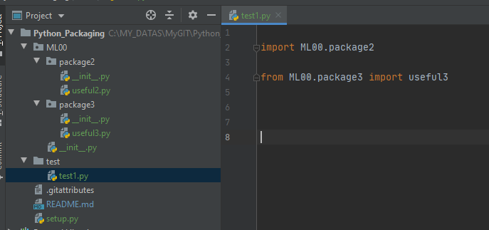

# Python_Packaging

Easy tuto / first trial to reuse code as package using setup tools.


add a setup.py at root

folder_structure_should look like this

> place \__init__.py in each folder to be packaged. respect the hierarchy



if needed:

```
pip install setuptools wheel
```

and/or

```
python -m pip install --user --upgrade setuptools wheel
```


from setup.py folder

- to build the wheel (in /dist folder) 

```
python setup.py bdist_wheel
```

- to install directly

```
pip install .
```


